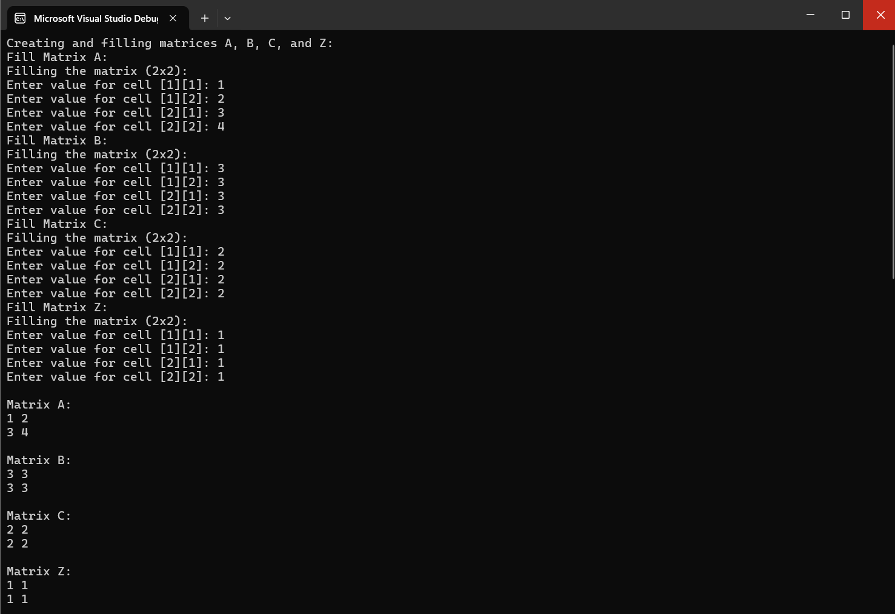

# OOP Matrix Library (C++)

This project implements a **2D Matrix class in C++** using Object-Oriented Programming.  
It includes constructors, copy constructor, destructor, exception handling, and rich operator overloading.

## Features
- Rule of Three: constructor, copy constructor, destructor (deep copy).
- Operator overloading: `+`, `-`, `*` (matrix × matrix and scalar × matrix), `=`, `==`, `<<`, `>>`, `[]`.
- Exception handling for invalid sizes and dimension mismatches.
- Casting operator to `double` → returns sum of all elements.
- Associativity checks (e.g., `(A+B)-C`).

## Screenshots
  


## Example Usage
```cpp
MyMatrix A(2,2), B(2,2), C(2,2);
std::cin >> A >> B >> C;

// Associativity check
MyMatrix D1 = (A + B) - C;
MyMatrix D2 = A + (B - C);

std::cout << "D1:\n" << D1;
std::cout << "D2:\n" << D2;

// Indexing example
std::cout << "A[0][1] = " << A[0][1] << std::endl;

// Exception example
try {
    MyMatrix invalid(-1, 3);   // should throw
} catch (const std::exception& e) {
    std::cout << "Error: " << e.what() << std::endl;
}
